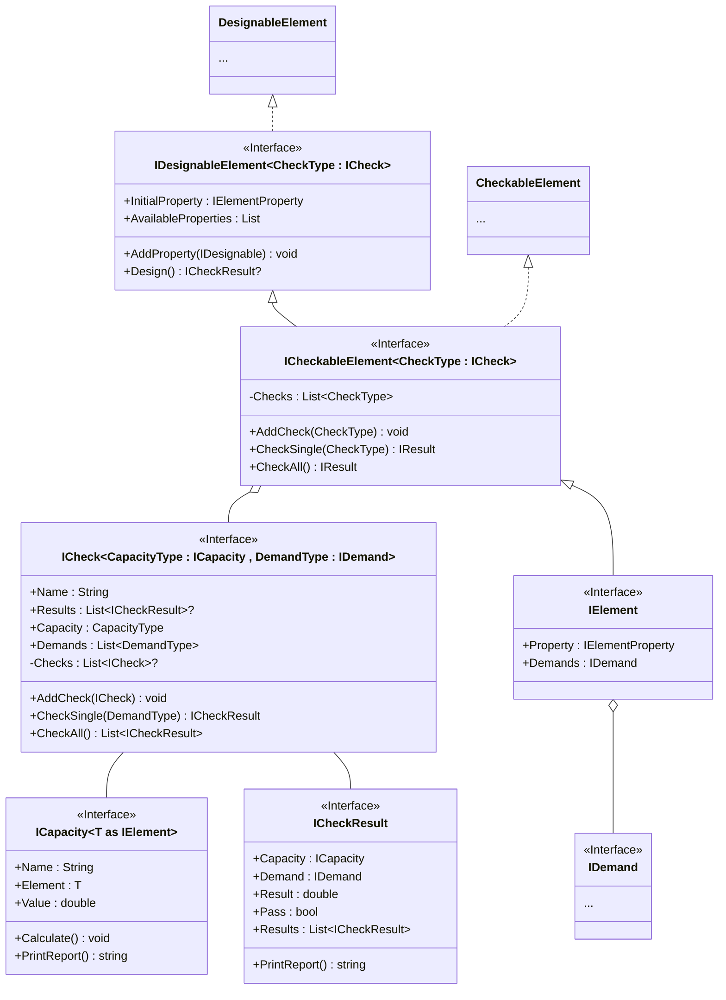

# Design framework

This page describes the design framework used to describe the capacity of elements and their checking against provided demands.

> [!NOTE]
> The below is out of date, and will need to be updated based on what has currently been implemented.

## Abstract representation

This diagram shows the proposed structure of the interfaces that make up the Element Design Framework. The section below shows how these are may be implemented for the Purlin design.

> A number of Generic types may be required to allow these to be implemented properly - for example a `PurlinBendingCheck : ICheck` should really only be able to contain `PurlinCapacity : ICapacity` and not just any `ICapacity`.
>
> This means that it may need to become `ICheck<CapacityType, DemandType>` where `CapacityType : ICapacity` and `DemandType : IDemand`, such that `PurlinBendingCheck : ICheck<PurlinCapacity, PurlinDemand>`. This might make future development a little bit more complicated.

The framework is made up of the following interfaces

- `ICheck` - Checks a number of `IDemand`s against a single `ICapacity`.
  > There will likely need to be some kind of tree structure here, as some checks are dependent on later checks, e.g. combined actions.
- `ICapacity` - Calculates a capacity (e.g. bending capacity, shear capacity, axial capacity, etc.) based on an `IElementProperty` dependency that is injected into it.
- `IDemand` - An adaptor that converts some actions (may be user generated or come from an analysis process) into something that can be compared by an `ICheck`.
- `ICheckResult` - A result produced by an `ICheck` that includes reference to the `IDemand` and `ICapacity`, and can be printed to a reporting string (i.e. something that includes all the calculations performed and the results).
  > The current proposal is to allow nesting of `ICheck`s, but it may perhaps be better to have an `ICheckResultAggregator` interface that acts as a container for multiple checks. This depends on how the tree structure is implemented for complex checks.
- `IElementProperty` - All of the properties that may be changed by the user or automated design process, e.g. $I_x$, $Z_x$ etc.
- `IElement` - A pretty generic element that could represent a purlin, column, footing, etc.
- `ICheckableElement` - An element that contains one or many checks to be done.
- `IDesignableElement` - An extension of `ICheckableElement` that will optimise the element by selecting the best `IProperty` for the job out of a list.

> `?` indicates that the member is nullable.

## Things to consider

- Nested, complex checks will need to be implemented. This should be done with a tree structure (i.e. [Composite Pattern](https://refactoring.guru/design-patterns/composite)), which is implemented above but has not been well considered.
