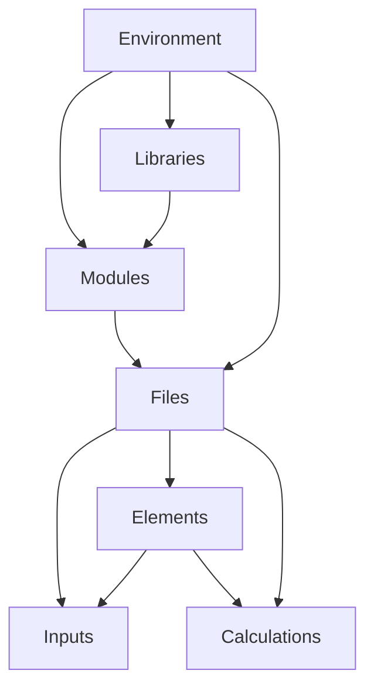
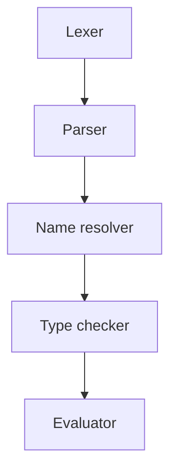

# Architecture

## Code structure

The following components make up an entire runtime. Each component contains represents an individual lexical scope.

- `Module`: A module comprising a number of logically grouped together `File`s. These are representated as folders
  containing the files.
- `Libraries`: A collection of modules that is collected within a folder containing a `LibraryName.slib` folder.
- `File`: An individual file, which may contain a group of elements. Does not have a name, although if an element exists
  in the file the name should match the element name. Source files have the extension `.sun`.
- `Element`: A collection of related variables and functions, often representing a physical element.
- `Inputs`: A named variable that can be altered upon execution but has a single default value and unit.
- `Calculations`: A function that is evaluated at runtime and makes reference to any number of other inputs or
  calculations.
- `Environment`: An environment contains variable values and may be passed into any executable node to commence
  evaluation of that node.

When compiling a program, the entry point to compilation may be:

- `Library`: A library is compiled but not executed.
- `File`: A collection of source code is entered as the root. All referenced libraries are fully compiled if not
  executed.

> Question: Why can't Modules or Elements or even calculations be used as compilation entry points? Should we allow any
> node in the tree to be used as a compilation entry point (for testing purposes), and just provide warnings when the
> entire tree is compiled in the tooling?



### Shadowing of file names

The name of an element can shadow the name of the file that it is in, but
otherwise the name of the file is the scope that all the contained members are in. That is, if an element name is the
same as the name of the file it is in, accessing the file name accesses the element as well.

For example:

```sunset
// File: A.sunset
// Accessed with A
element A:
  ...
  
// Accessed with A.B
element B:
  ...
```

If an element name is shadowing a file name, internally it is given the name `FileName.$element`, where `$` is a
restricted character otherwise and can therefore only be given to one element.

If an anonymous file is created (for example in interactive scripts), it is given the name `$` to add it to a general
anonymous scope.

## File types

The following file types and their extensions are parts of the Sunset code ecosystem:

- `.slib`: A library of Sunset code.
- `.sunset`: Contains code in the Sunset language.
- `.smd`: A Markdown file containing Sunset code to be evaluated
- `.sdia`: A diagramming file.

## Interpreter architecture

The interpreter is made up of the following components.

- `Lexer`: Converts code into Tokens.
- `Parser`: Converts Tokens into an Abstract Syntax Tree composed of statement nodes.
- `Name resolver`: Resolves names of identifiers.
- `Type checker`: Checks types and the compatibility of units.
- `Evaluator`: Evaluates the results of all functions.

