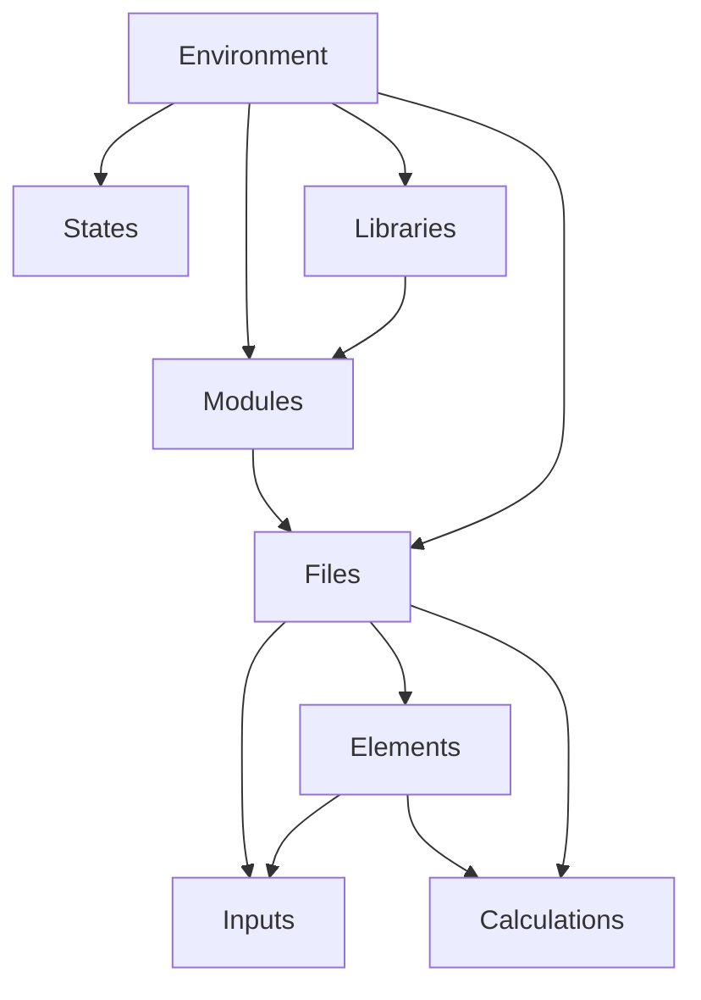
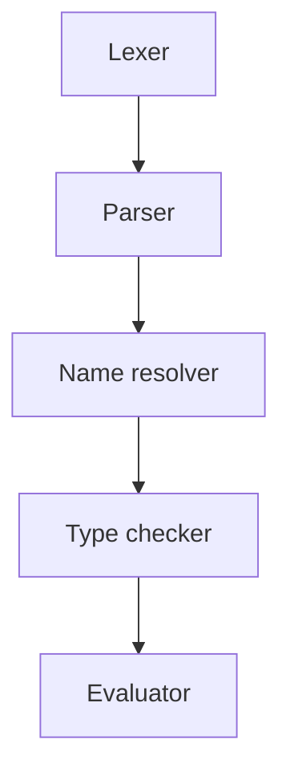

# Architecture

## Code structure

The following components make up an entire runtime. Each component contains represents an individual lexical scope.

- `Environment`: An environment is the current runtime and acts as the root of the compiled tree. It contains zero or
  more `Library` nodes and up to one entry point source `File`s.
- `Library`: A collection of modules that is collected within a folder containing a `LibraryName.slib` file.
- `Module`: A module comprising a number of logically grouped together `File`s. These are represented as folders
  containing the files.
- `File`: An individual file, which may contain a group of elements. Source files have the extension `.sunset`.
- `Element`: A collection of related variables and functions, often representing a physical element.
- `Variable`: A variable is a named function.
- `Calculation`: A `Variable` that is evaluated at runtime and makes reference to any number of other inputs or
  calculations.
- `Input`: A `Calculation` with a value that can be altered upon execution by passing in an `Instance` but has a single
  default value.
- `Instance`: An instance contains `Input` values and may be passed into any executable node to commence
  evaluation of that node.

When compiling a program, the entry point to compilation may be:

- `Library`: A library is compiled but not executed.
- `File`: A collection of source code is entered as the root. All referenced libraries are fully compiled.

> Question: Why can't Modules or Elements or even calculations be used as compilation entry points? Should we allow any
> node in the tree to be used as a compilation entry point (for testing purposes), and just provide warnings when the
> entire tree is compiled in the tooling?
>
> Answer: This makes it tricky from a name resolution point of view. Let's just say that there are two points of
> compilation: a library and a single source file. However, execution can occur using a particular environment (or an
> empty environment) at all levels.



### Shadowing of file names

The name of an element can shadow the name of the file that it is in, but
otherwise the name of the file is the scope that all the contained members are in. That is, if an element name is the
same as the name of the file it is in, accessing the file name accesses the element as well.

For example:

```sunset
// File: A.sunset
// Accessed with A
element A:
  ...
  
// Accessed with A.B
element B:
  ...
```

If an element name is shadowing a file name, internally it is given the name `FileName.$element`, where `$` is a
restricted character otherwise and can therefore only be given to one element.

If an anonymous file is created (for example in interactive scripts), it is given the name `$` to add it to a general
anonymous scope.

## File types

The following file types and their extensions are parts of the Sunset code ecosystem:

- `.slib`: A library of Sunset code.
- `.sunset`: Contains code in the Sunset language.
- `.smd`: A Markdown file containing Sunset code to be evaluated
- `.sdia`: A diagramming file.

## Interpreter architecture

The interpreter is made up of the following components.

- `Lexer`: Converts code into Tokens.
- `Parser`: Converts Tokens into an Abstract Syntax Tree composed of statement nodes.
- `Name resolver`: Resolves names of identifiers.
- `Type checker`: Checks types and the compatibility of units.
- `Evaluator`: Evaluates the results of all functions.



# Name resolution strategy

If not preceded by the access modifier `.`, names are checked by each `Scope`. The `Scope` does a breadth first search
starting with itself then moving upwards to its parent `Scope`. If it can't find the name in any parent the `Scope`
looks at the `Library` elements that are available in the `Environment`.

## Access modifiers

The access modifier is an operator with left precedence. The right operand of the access operator is found by looking at
the names that are available in the `Scope` that is defined by the left operand.

# Scoping responsibilities

A parent scope is always responsible for setting the name and parent reference in the child scope when the scope is
created.