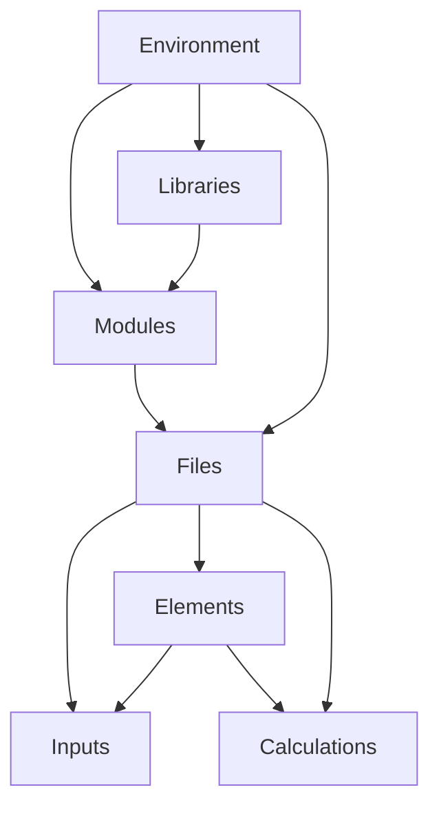
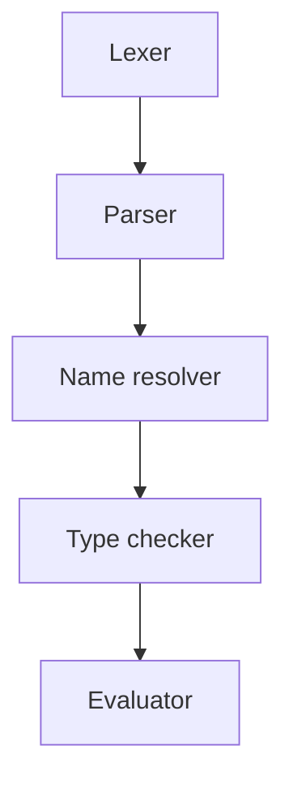

# Architecture

## Code structure

The following components make up an entire runtime. Each component contains represents an individual lexical scope.

- `Environment`: An environment containing the currently running code.
- `Libraries`: A collection of modules that is collected within a folder containing a `LibraryName.slib` folder.
- `Module`: A module comprising a number of logically grouped together `File`s. These are representated as folders
  containing the files.
- `File`: An individual file, which may contain a group of elements. Does not have a name, although if an element exists
  in the file the name should match the element name. Source files have the extension `.sun`.
- `Element`: A collection of related variables and functions, often representing a physical element.
- `Inputs`: A named variable that can be altered upon execution but has a single default value and unit.
- `Calculations`: A function that is evaluated at runtime and makes reference to any number of other inputs or
  calculations.

## File types

The following file types and their extensions are parts of the Sunset code ecosystem:

- `.slib`: A library of Sunset code.
- `.sunset`: Contains code in the Sunset language.
- `.smd`: A Markdown file containing Sunset code to be evaluated
- `.sdia`: A diagramming file.

## Interpreter architecture

The interpreter is made up of the following components.

- `Lexer`: Converts code into Tokens.
- `Parser`: Converts Tokens into an Abstract Syntax Tree composed of statement nodes.
- `Name resolver`: Resolves names of identifiers.
- `Type checker`: Checks types and the compatibility of units.
- `Evaluator`: Evaluates the results of all functions.

